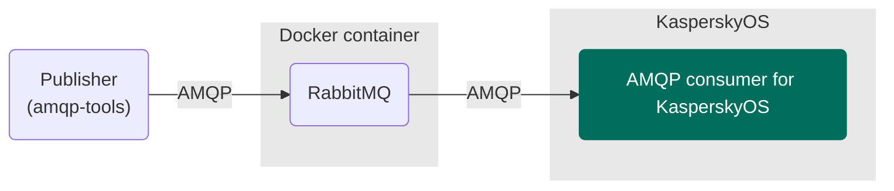

# AMQP consumer example

An example of developing a KasperskyOS-based solution that is an implementation of an AMQP consumer.

## Table of contents
- [AMQP consumer example](#amqp-consumer-example)
  - [Table of contents](#table-of-contents)
  - [Solution overview](#solution-overview)
    - [List of programs](#list-of-programs)
    - [Solution scheme](#solution-scheme)
    - [Initialization description](#initialization-description)
    - [Security policy description](#security-policy-description)
  - [Getting started](#getting-started)
    - [Prerequisites](#prerequisites)
      - [QEMU](#qemu)
      - [Raspberry Pi 4 B](#raspberry-pi-4-b)
    - [Building and running the example](#building-and-running-the-example)
      - [QEMU](#qemu-1)
      - [Raspberry Pi 4 B](#raspberry-pi-4-b-1)
      - [CMake input files](#cmake-input-files)
  - [Usage](#usage)

## Solution overview

### List of programs

* `Consumer`—Program that is an implementation of the AMQP consumer
* `Ntpd`—NTP client implementation program that receives time parameters from external NTP servers
in the background and passes them to the KasperskyOS kernel
* `BlobContainer`—Program that loads dynamic libraries used by other programs into shared memory
* `EntropyEntity`—Random number generator
* `DNetSrv`—Driver for working with network cards
* `VfsSdCardFs`—Program that supports the SD Card file system
* `VfsNet`—Program that is used for working with the network
* `Dhcpcd`—DHCP client implementation program that gets network interface parameters from an external
DHCP server in the background and passes them to the virtual file system
* `SDCard`—SD Card driver
* `BSP`—Driver for configuring pin multiplexing parameters (pinmux)
* `Bcm2711MboxArmToVc`—Mailbox driver for Raspberry Pi 4 B

### Solution scheme



### Initialization description

<details><summary>Statically created IPC channels</summary>

* `amqp.Consumer` → `kl.VfsSdCardFs`
* `amqp.Consumer` → `kl.VfsNet`
* `amqp.Consumer` → `kl.BlobContainer`
* `kl.Ntpd` → `kl.VfsSdCardFs`
* `kl.Ntpd` → `kl.VfsNet`
* `kl.BlobContainer` → `kl.VfsSdCardFs`
* `kl.VfsNet` → `kl.EntropyEntity`
* `kl.VfsNet` → `kl.drivers.DNetSrv`
* `kl.VfsNet` → `kl.BlobContainer`
* `kl.rump.Dhcpcd` → `kl.BlobContainer`
* `kl.rump.Dhcpcd` → `kl.VfsSdCardFs`
* `kl.rump.Dhcpcd` → `kl.VfsNet`
* `kl.VfsSdCardFs` → `kl.drivers.SDCard`
* `kl.VfsSdCardFs` → `kl.EntropyEntity`
* `kl.VfsSdCardFs` → `kl.BlobContainer`
* `kl.EntropyEntity` → `kl.BlobContainer`
* `kl.drivers.DNetSrv` → `kl.drivers.Bcm2711MboxArmToVc`
* `kl.drivers.DNetSrv` → `kl.BlobContainer`
* `kl.drivers.SDCard` → `kl.drivers.BSP`
* `kl.drivers.SDCard` → `kl.BlobContainer`
* `kl.drivers.Bcm2711MboxArmToVc` → `kl.BlobContainer`
* `kl.drivers.BSP` → `kl.BlobContainer`

</details>

The [`./einit/src/init.yaml.in`](einit/src/init.yaml.in) template is used to automatically generate
part of the solution initialization description file `init.yaml`. For more information about the
`init.yaml.in` template file, see the
[KasperskyOS Community Edition Online Help](https://click.kaspersky.com/?hl=en-us&link=online_help&pid=kos&version=1.2&customization=KCE_cmake_yaml_templates).

### Security policy description

The [`./einit/src/security.psl.in`](einit/src/security.psl.in) template is used to automatically
generate part of the `security.psl` file using CMake tools. The `security.psl` file contains part of
a solution security policy description. For more information about the `security.psl` file, see
[Describing a security policy for a KasperskyOS-based solution](https://click.kaspersky.com/?hl=en-us&link=online_help&pid=kos&version=1.2&customization=KCE_ssp_descr).

[⬆ Back to Top](#Table-of-contents)

## Getting started

### Prerequisites

To install [KasperskyOS Community Edition SDK](https://os.kaspersky.com/development/) and run examples
on QEMU or the Raspberry Pi hardware platform, make sure you meet all the
[System requirements](https://click.kaspersky.com/?hl=en-us&link=online_help&pid=kos&version=1.2&customization=KCE_system_requirements)
listed in the KasperskyOS Community Edition Developer's Guide.

#### QEMU

1. Make sure that the Docker software is installed and running.
   ```
   $ systemctl status docker
   ```
1. To run the RabbitMQ message broker, run the [RabbitMQ Docker official image](https://hub.docker.com/_/rabbitmq)
using the following command:
   ```
   $ docker run -d -p 5672:5672 --hostname my-rabbit --name some-rabbit rabbitmq:3
   ```
1. Create an alias for your network interface with the address `10.0.2.2/24`:
   ```
   $ sudo ip a a 10.0.2.2/24 dev docker0
   ```
   >A static IP address `10.0.2.2` and port `5672` are set for RabbitMQ message broker using the
`AMQP_BROKER_ADDRESS` and `AMQP_BROKER_PORT` environment variables. You can change the broker address
and port in the file [`./einit/src/init.yaml.in`](einit/src/init.yaml.in) according to your network
configuration.
1. Install the package `amqp-tools` (command-line utilities for interacting with AMQP servers):
   ```
   $ sudo apt-get update -y
   $ sudo apt install amqp-tools
   ```
1. To check your environment, run the following command:
   ```
   $ docker stats
   ```
   The screen should display information about the `some-rabbit` running container.

#### Raspberry Pi 4 B

1. To install required packages on your host system, run the following command:
   ```
   $ sudo apt install rabbitmq-server amqp-tools
   ```
1. Set your computer network interface to have a static IPv4 address `10.0.2.2/24`.
1. To make sure the RabbitMQ message broker is operating, run the following command:
   ```
   $ systemctl status rabbitmq-server.service
   ```

By default in the RabbitMQ message broker, the `guest` user is [prohibited](https://www.rabbitmq.com/access-control.html#loopback-users)
from connecting from remote hosts; it can only connect over a loopback interface (i.e. `localhost`).
This applies to connections regardless of the protocol. To get around this limitation, follow
the steps below:

1. Use `rabbitmqctl` to create a new user with the desired credentials:
   ```
   $ sudo rabbitmqctl add_user <user_name> <password>
   ```
1. Use the following command to set the virtual host access permissions for the new user:
   ```
   $ sudo rabbitmqctl set_permissions --vhost '/' <user_name> '.*' '.*' '.*'
   ```
   (The full permissions are for illustrative purposes only. In a real solution, grant permissions
carefully.)
1. Replace the `guest`/`guest` credentials with <`user_name`>/<`password`> in the
[`consumer.cpp`](consumer/src/consumer.cpp) file.

[⬆ Back to Top](#Table-of-contents)

### Building and running the example

The AMQP consumer for KasperskyOS is built using the CMake build system, which is provided in the
KasperskyOS Community Edition SDK.

In this example, an AMQP publisher must be started on the host operating system, and the AMQP consumer
must be started on KasperskyOS.

The `SDK_PREFIX` environment variables affects the build of the example. It specifies the path to
the installed version of the KasperskyOS Community Edition SDK.

Run the following command `./cross-build.sh <TARGET> [SDK_PATH]`, where:

* `TARGET` can take one of the following values: `qemu` for QEMU or `rpi` for Raspberry Pi 4 B.
* `SDK_PATH` specifies the path to the installed version of the KasperskyOS Community Edition SDK.
If not specified, the path defined in the `SDK_PREFIX` environment variable is used. The value
specified in `SDK_PATH` option takes precedence over the value of the `SDK_PREFIX` environment variable.

For example, review the following command:
```
$ ./cross-build.sh qemu /opt/KasperskyOS-Community-Edition-<version>
```
The command builds the AMQP consumer example with the built-in RabbitMQ-C AMQP client library and runs
the KasperskyOS-based solution image on QEMU. The solution image is based on the SDK found in the
`/opt/KasperskyOS-Community-Edition-<version>` path, where `version` is the latest version
number of the KasperskyOS Community Edition SDK.

#### QEMU

Running `cross-build.sh` creates a KasperskyOS-based solution image that includes the example.
The `kos-qemu-image` solution image is located in the `./build/einit` directory.

The `cross-build.sh` script both builds the example on QEMU and runs it.

#### Raspberry Pi 4 B

Running `cross-build.sh` creates a KasperskyOS-based solution image that includes the example and
a bootable SD card image for Raspberry Pi 4 B. The `kos-image` solution image is located in the
`./build/einit` directory. The `rpi4kos.img` bootable SD card image is located in the `./build`
directory.

1. To copy the bootable SD card image to the SD card, connect the SD card to the computer and
run the following command:

   `$ sudo dd bs=64k if=build/rpi4kos.img of=/dev/sd[X] conv=fsync`,

   where `[X]` is the final character in the name of the SD card block device.

1. Connect the bootable SD card to the Raspberry Pi 4 B.
1. Supply power to the Raspberry Pi 4 B and wait for the example to run.

You can also use an alternative option to prepare and run the example:

1. Prepare Raspberry Pi 4 B and a bootable SD card to run the example by following the instructions in the
[KasperskyOS Community Edition Online Help](https://click.kaspersky.com/?hl=en-us&link=online_help&pid=kos&version=1.2&customization=KCE_preparing_sd_card_rpi).
1. Run the example by following the instructions in the
[KasperskyOS Community Edition Online Help](https://click.kaspersky.com/?hl=en-us&link=online_help&pid=kos&version=1.2&customization=KCE_running_sample_programs_rpi)

#### CMake input files

[./consumer/CMakeLists.txt](consumer/CMakeLists.txt)—CMake commands for building the `Consumer` program.

[./einit/CMakeLists.txt](einit/CMakeLists.txt)—CMake commands for building the `Einit` program
and the solution image.

[./CMakeLists.txt](CMakeLists.txt)—CMake commands for building the solution.

[⬆ Back to Top](#Table-of-contents)

## Usage

After building and running the example, follow these steps:

1. Wait until a message similar to the following appears in the QEMU standard output:
   ```
   [Consumer] Waiting to receive data ...
   ```
1. To start the AMQP publisher on the host system, run the following command:
   ```
   $ for count in {1..100}; do amqp-publish --server=localhost --port=5672 --exchange=amq.direct --routing-key=test --body="{\"sequence\"=$count}"; done
   ```
1. A message similar to the following should appear in the QEMU standard output:
   ```
   Delivery 1, exchange: amq.direct, routingkey: test
   ----
   000000007b2273657175656e :6365223d317d        {"sequence"=1}
   0000000e

   ...

   Delivery 100, exchange: amq.direct, routingkey: test
   ----
   000000007b2273657175656e :6365223d3130307d  {"sequence"=100}
   00000010
   ```

[⬆ Back to Top](#Table-of-contents)

© 2024 AO Kaspersky Lab
